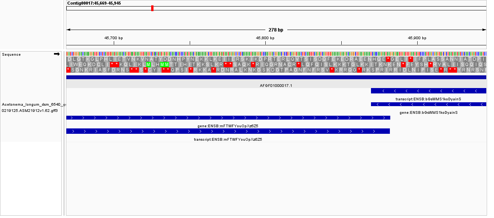
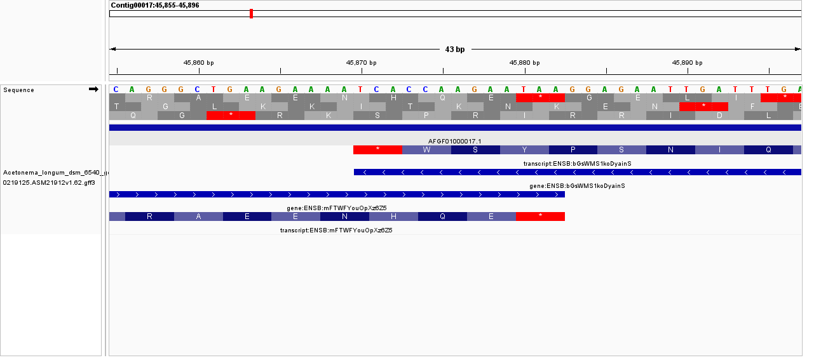
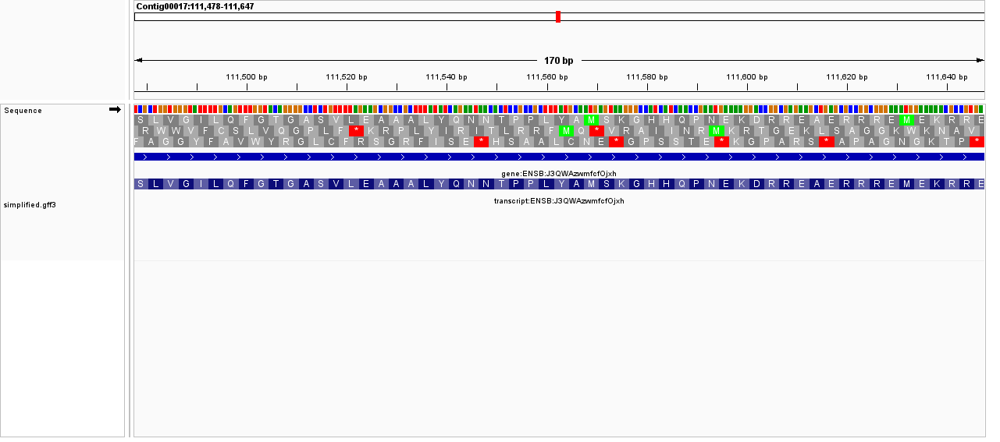
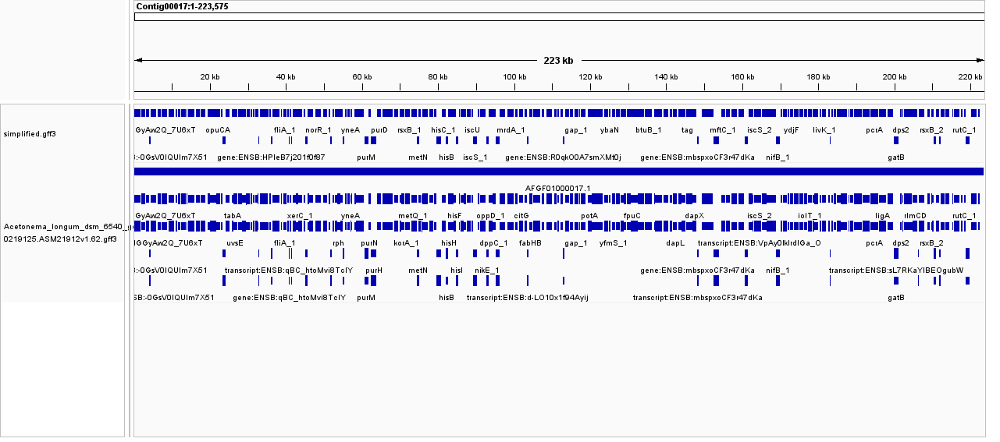
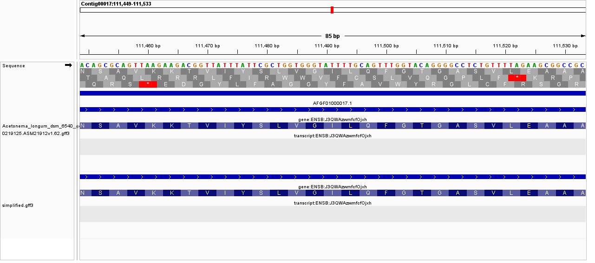
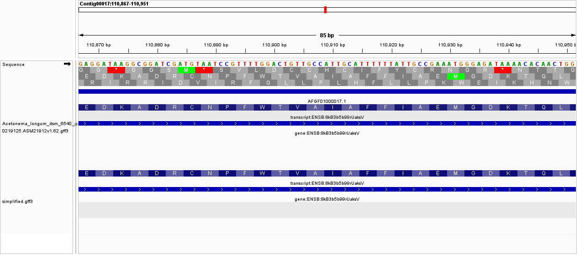

# Visualizing Genomic Data

## Download Data
* I downloaded the **Acetonema longum DSM 6540** genome FASTA and GFF annotation files from Ensembl Bacteria


```bash

#FASTA Files
curl -O https://ftp.ensemblgenomes.ebi.ac.uk/pub/bacteria/current/fasta/bacteria_1_collection/acetonema_longum_dsm_6540_gca_000219125/dna/Acetonema_longum_dsm_6540_gca_000219125.ASM21912v1_.dna.toplevel.fa.gz
curl -O https://ftp.ensemblgenomes.ebi.ac.uk/pub/bacteria/current/gff3/bacteria_1_collection/acetonema_longum_dsm_6540_gca_000219125/Acetonema_longum_dsm_6540_gca_000219125.ASM21912v1.62.gff3.gz

# Annotation files
gunzip Acetonema_longum_dsm_6540_gca_000219125.ASM21912v1_.dna.toplevel.fa.gz
gunzip Acetonema_longum_dsm_6540_gca_000219125.ASM21912v1.62.gff3.gz 

```

## 1. How big is the genome, and how many features of each type does the GFF file contain?

```bash

grep -v ">" Acetonema_longum_dsm_6540_gca_000219125.ASM21912v1_.dna.toplevel.fa | wc -m

```

My Output:

```
The Genome is 4395200 basepair long

```
**Feature Counts in GFF:**

``` bash
cut -f3 Acetonema_longum_dsm_6540_gca_000219125.ASM21912v1.62.gff3 | sort | uniq -c
```

 My Output:
 ```
 4047 CDS
   4107 exon
   4047 gene
   4047 mRNA
     60 ncRNA
     60 ncRNA_gene
    296 region
```


## 2. From your GFF file, separate the intervals of type "gene" or "transcript" into a different file.

```bash

awk '$3=="gene" || $3=="transcript"' Acetonema_longum_dsm_6540_gca_000219125.ASM21912v1.62.gff3 > simplified.gff3

```


## **IGV Genome Visualization**

**Import the downloaded FASTA and GFF files into IGV application. - I have selected Acetonema longum genome and annotations**


*Figure 1: Visualization of the Acetonema_longum genome with annotatinos*


*Figure 2: Visualization of the Acetonema_longum genome with annotatinos*

**Visualizing the simplified GFF file**


*Figure 3: Visualization of the Simplified GFF file*

**Compare the visualization of the original GFF with the simplified GFF**


*Figure 4: Compare the visualization of the original GFF with the simplified GFF*

* **Note :** When visualized in IGV, the original GFF file displayed a large number of features, including genes, transcripts, exons, coding sequences (CDS), UTRs, and regulatory elements. While this provided a comprehensive view of the genome, it resulted in a dense and cluttered visualization, making it difficult to focus on the higher-level genomic intervals.
* In contrast, the simplified GFF file, containing only gene and transcript features, produced a much cleaner and more interpretable track. This allowed clear identification of gene boundaries, transcript organization, and orientation across the genome without the distraction of lower-level details such as exons and CDS.


**Visualising the translation table and the orientation**


*Figure 5: Compare the visualization of the original GFF with the simplified GFF*

* **Note:** The translation table needs to be viewed in the correct strand orientation (+ or -). Without considering strand direction, codons and start/stop signals appear incorrect, but with proper orientation the reading frame aligns correctly and the protein-coding sequence makes biological sense.

**Start and stop codons of a specific gene**


*Figure 6: The Start and Stop codons of a gene in the genome*


