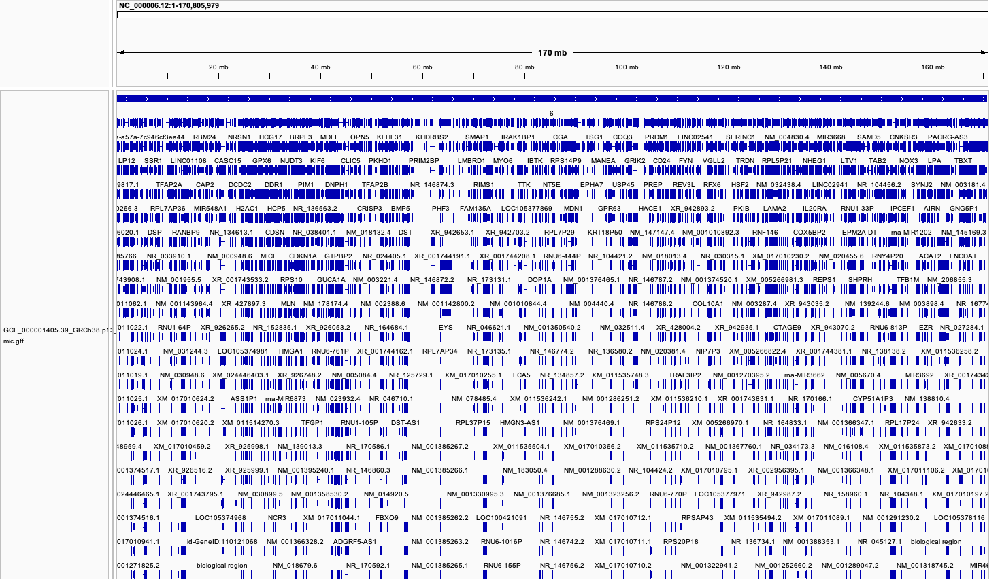
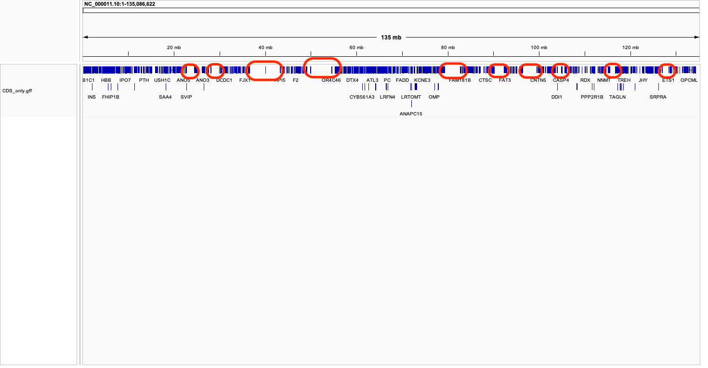

# Download genomic data
I selected the Zika virus-related study (group 2) and found the corresponding RNA-seq dataset, accession GSE78711. Since the experiments were performed on human cells, I retrieved the Homo sapiens reference genome and its annotation files in FASTA and GFF formats to visualize the genome features and gene annotations.


## Download the genome FASTA and GFF files

``` bash
# Create a directory for the genome data
mkdir -p ~/genome_data
cd ~/genome_data

# Download the genome FASTA file using curl
curl -O ftp://ftp.ncbi.nlm.nih.gov/genomes/all/GCF/000/001/405/GCF_000001405.39_GRCh38.p13/GCF_000001405.39_GRCh38.p13_genomic.fna.gz

# Download the GFF annotation file using curl
curl -O ftp://ftp.ncbi.nlm.nih.gov/genomes/all/GCF/000/001/405/GCF_000001405.39_GRCh38.p13/GCF_000001405.39_GRCh38.p13_genomic.gff.gz

# Unzip the downloaded files
gunzip *.gz

```

## Use IGV to visualize the genome


Figure 1: Genome visualization and annotation using IGV.


## Length of the genome


```
grep -v ">" GCF_000001405.39_GRCh38.p13_genomic.fna | wc -c

```
Output:

```
The genome is 3312990637 basepairs long
```

## How many features of each type exist in the GFF file

```
grep -v "#" GCF_000001405.39_GRCh38.p13_genomic.gff | cut -f3 | sort | uniq -c | sort -nr
```

Output

```
2007960 exon
1499544 CDSi
122549 mRNA
42848 gene
31078 match
28864 lnc_RNA
22914 cDNA_match
18505 transcript
18363 pseudogene
7615 biological_region
3184 miRNA
2119 primary_transcript
2045 enhancer
1591 sequence_feature
1374 protein_binding_site
1327 transcriptional_cis_regulatory_region
 660 V_gene_segment
 643 region
 632 recombination_feature
 621 nucleotide_motif
 597 tRNA
 589 snoRNA
 492 non_allelic_homologous_recombination_region
 418 promoter
 361 meiotic_recombination_region
 188 mobile_genetic_element
 171 DNaseI_hypersensitive_site
 137 conserved_region
 128 J_gene_segment
 101 silencer
  93 CAGE_cluster
  92 origin_of_replication
  64 tandem_repeat
  64 snRNA
  64 rRNA
  61 repeat_instability_region
  61 D_gene_segment
  56 enhancer_blocking_element
  54 mitotic_recombination_region
  43 C_gene_segment
  31 ncRNA
  30 TATA_box
  28 sequence_alteration
  24 centromere
  24 antisense_RNA
  20 direct_repeat
  19 response_element
  15 GC_rich_promoter_region
  14 matrix_attachment_site
  14 locus_control_region
  13 sequence_secondary_structure
  12 minisatellite
  12 epigenetically_modified_region
  11 replication_regulatory_region
   9 insulator
   6 repeat_region
   6 chromosome_breakpoint
   5 microsatellite
   5 dispersed_repeat
   5 CAAT_signal
   4 Y_RNA
   4 vault_RNA
   4 scRNA
   4 nucleotide_cleavage_site
   3 replication_start_site
   2 imprinting_control_region
   1 telomerase_RNA
   1 sequence_comparison
   1 RNase_P_RNA
   1 RNase_MRP_RNA
   1 regulatory_region
   1 D_loop

```

## Identifying the longest gene

```
awk '$3 == "gene" {print $9, $5 - $4}' GCF_000001405.39_GRCh38.p13_genomic.gff | sort -k2,2nr | head -1

```

Output:

```
ID=gene-RBFOX1;Dbxref=GeneID:54715,HGNC:HGNC:18222,MIM:605104;Name=RBFOX1;description=RNA 2473591

```

**Explaination:**

Gene name : RBFOX1 

Description : RNA binding fox-1 homolog 1 (truncated in your output) 

Gene length : 2473591 

NCBI Gene ID: 54715

**Function:** Encodes an RNA-binding protein involved in alternative splicing regulation, especially in neuronal tissues.


* RBFOX1 is an RNA-binding protein that regulates alternative splicing, especially in the nervous system. It plays a key role in shaping how different isoforms of neural genes are expressed, which is crucial for brain development and function.
* Variants or disruptions in RBFOX1 have been linked to neurodevelopmental disorders, including autism, epilepsy, and intellectual disability. Because of its role in controlling splicing networks, changes in RBFOX1 can ripple across many pathways involved in neuronal signaling and connectivity.

## Identifying another gene:

```
awk '$3 == "gene" {print $9, $5 - $4}' GCF_000001405.39_GRCh38.p13_genomic.gff | sort -k2,2nr | head -2 | tail -1

```

Output:
```
ID=gene-CNTNAP2;Dbxref=GeneID:26047,HGNC:HGNC:13830,MIM:604569;Name=CNTNAP2;description=contactin 2304791
```
* CNTNAP2 (Contactin Associated Protein-Like 2) is a large gene that encodes a member of the neurexin family, proteins important for communication between neurons. It’s highly expressed in the brain, especially in regions involved in language, social behavior, and cognitive function.
* Variants in CNTNAP2 have been linked to several neurodevelopmental conditions, including autism, epilepsy, and language impairments. Because it plays such a central role in neural connectivity and signaling, disruptions in CNTNAP2 can have wide-reaching effects on brain development and function.


## Analysing the intragenomic space and packing nature of the genome


**1. Finding the number of genes:**

```
awk '$3=="gene"' GCF_000001405.39_GRCh38.p13_genomic.gff | wc -l
```

Output:

```
42279
```

**2. Measure the genomic size - total number of basepairs**

```
grep -v ">" GCF_000001405.39_GRCh38.p13_genomic.fna | tr -d '\n' | wc -c

```

Output:

```
3272089205
```

**3. total length of all genes - how many basepairs does all the genes cover**
```
awk '$3=="gene" {sum += $5-$4} END {print sum}' GCF_000001405.39_GRCh38.p13_genomic.gff

```

Output:

```
1804398806
```

**4. To find the largest and average intragenic spaces among the genes**

```
# for largest intragenic spaces
awk '$3=="gene" {print $1,$4,$5}' GCF_000001405.39_GRCh38.p13_genomic.gff | \
  sort -k1,1 -k2,2n | \
  awk '{if(prev_chr==$1){dist=$2-prev_end; if(dist>0) print dist} prev_chr=$1; prev_end=$3}' | \
  sort -nr | head

# for average intragenic spaces
awk '$3=="gene" {print $1,$4,$5}' GCF_000001405.39_GRCh38.p13_genomic.gff | \
  sort -k1,1 -k2,2n | \
  awk '{if(prev_chr==$1){dist=$2-prev_end; if(dist>0){print dist; sum+=dist; count++}} prev_chr=$1; prev_end=$3} END {print "Average intergenic distance:", sum/count}'

```

**Interpretation:** 

* Looking at the human genome, genes are not evenly spread out. Some are tightly clustered or even overlap, often due to multiple isoforms or non-coding RNAs, while other regions have large gaps between them. On average, intergenic spaces are about 58 kb, showing that much of the genome consists of open regions with regulatory elements and repeats, rather than being densely packed with genes.


## An estimation on how much genome is covered through IGV

Simplify the actual GFF file

```
awk -F'\t' '$3=="CDS"' GCF_000001405.39_GRCh38.p13_genomic.gff > CDS_only.gff
```

**Visualise it in IGV along with the genome file**


Figure 2: CDS coverage estimate on chromosome 11 135Mb lemgth.

* **Note:** In the 135 Mb stretch of chromosome 11 (NC_000011.10:1–135,086,622), I observed that roughly 60 Mb consists of empty space with no coding sequences. The remaining portion contains genes, introns, and regulatory elements, but only a small fraction represents actual coding sequences. This shows that coding regions are sparsely distributed, and a large part of the genome is made up of intergenic and non-coding DNA.


## Alternative genome builds and research questions

Looking beyond GRCh38, other genome references can open up new perspectives.
* The Zika virus genome **(NC_012532.1)** could be used to study viral proteins and how they interact with host responses.
* The older human build, **GRCh37**, might reveal differences in annotations or alternative isoforms linked to cell cycle control.
* Meanwhile, a primate genome such as rhesus macaque **(GCF_003339765.1)** could help compare infection patterns across species and point to host-specific resistance factors.


