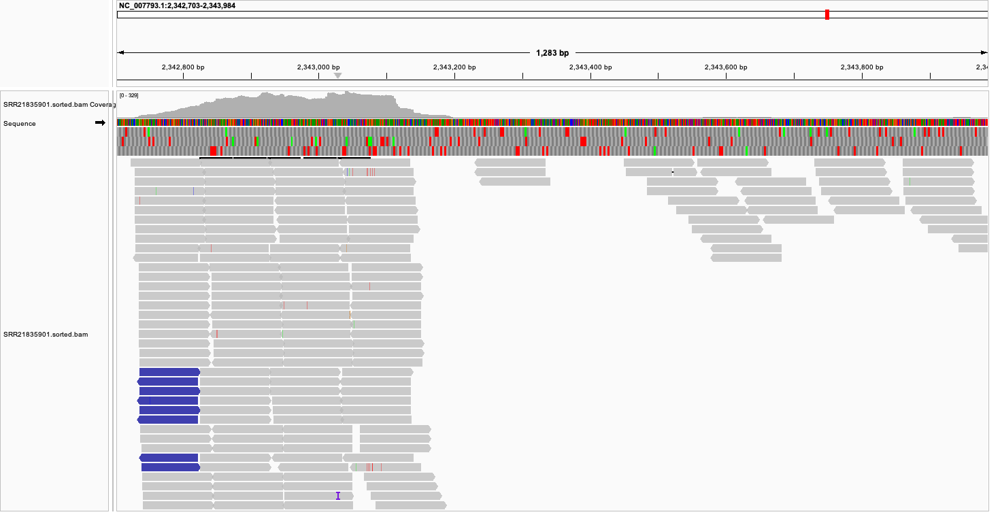

# Creating a Make file
This make file downloads sequencing reads, fetches a reference genome, performs alignment, and generates alignment statistics.

## Overview

The pipeline performs the following steps in sequence:
* Download - Downloads sequencing reads from SRA
* Genome - Fetches the reference genome from NCBI
* Index - Indexes the reference genome for alignment
* Align - Aligns reads to the reference genome and creates sorted BAM file
* Check - Generates alignment statistics

## Prerequisites

Before running this pipeline, ensure you have the following tools installed:
* bash - Shell environment
* fastq-dump (from SRA Toolkit) - For downloading SRA data
* efetch (from NCBI E-utilities) - For fetching reference genomes
* bwa - For genome indexing and read alignment
* samtools - For BAM file processing and statistics

## Configuration

You can customize the pipeline by modifying these variables at the top of the Makefile:
* SRR_NUMBER - SRA accession number to download (default: SRR21835901)
* REQUIRED_READS - Number of reads to download (default: 137931)
* ACC - NCBI accession for reference genome (default: NC_007793.1)
* READ_DIR - Directory for storing reads (default: reads)
* REF_GENOME - Path to reference genome file
* BAM_FILE - Output BAM file name

## Usage

## Run the entire pipeline:

```bash

make -f Makefile.mk

```

## Run individual steps

```bash

make -f Makefile.mk download genome index align check

```

## Run specific steps only

```bash

make -f Makefile.mk download    # Download sequencing reads only
make -f Makefile.mk genome      # Fetch reference genome only
make -f Makefile.mk index       # Index the genome only
make -f Makefile.mk align       # Perform alignment only
make -f Makefile.mk check       # Check alignment statistics only

```

**1. What percentage of reads aligned to the genome?**

99.76% of reads aligned to the genome.

**2. What was the expected average coverage?**

10 X

**3. What is the observed average coverage?**

9.86 X

**4. How much does the coverage vary across the genome?** (Provide a visual estimate.)

Coverage across the genome is highly uneven, with multiple high-depth clusters and several uncovered regions visible in IGV. The distribution appears random and indicates non-uniform sequencing coverage.


Figure 1: Visualizing the alignment and coverage in IGV.

