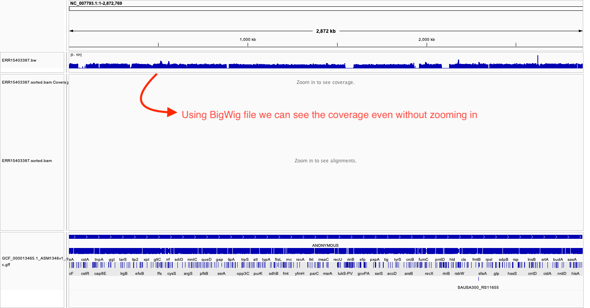
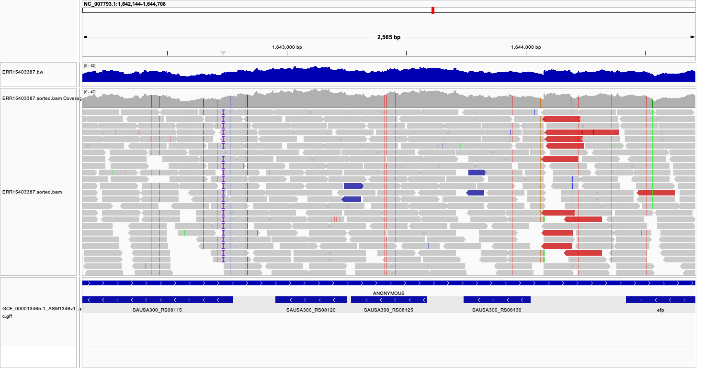

# Make file - Week 07 - Bigwig file generation

This readme file contains the information needed to run the makefile generated. The script written is able to It automatically calculates the exact number of reads needed to achieve your desired sequencing coverage, then downloads and processes the data through alignment and BigWig file generation.

## Basic usage

```bash

make -f makefile.mk all SRR=SRRXXXXXXX ACC=NC_XXXXXX.1 COVERAGE=15

```

## Example

```bash

make -f makefile.mk all SRR=ERR15403387 ACC=NC_007793.1 COVERAGE=15

```

## Required Parameters

Parameter	Description	Example
SRR	SRA Run accession number	SRR=ERR15403387
ACC	NCBI Reference genome accession	ACC=NC_007793.1
COVERAGE	Desired sequencing coverage	COVERAGE=15

## Output Files

Output directories:

```bash

project/
├── reads/           # Downloaded FASTQ files
├── refs/           # Reference genome files
├── bam/            # Aligned BAM files + indexes
└── bigwig/         # BigWig coverage files

```

I have taken staphylococus aureus genome and its corresponding reads from two sequencing platforms - illumina and oxford nanopore sequencing for this assignment. 
SRR34520458 – PacBio (single-end sequencing)
ERR15403387 – Illumina (paired-end sequencing)

1. Briefly describe the differences between the alignment in both files.
* The PacBio (SRR34520458) alignment produced fewer but longer reads, resulting in concentrated high-coverage regions, while the Illumina (ERR15403387) paired-end alignment generated many short reads distributed more evenly across the genome. This leads to higher overall read count and smoother coverage in Illumina data, whereas PacBio data shows localized depth spikes due to long continuous reads.

2. Briefly compare the statistics for the two BAM files.

Input:

```bash

samtools flagstat ERR15403387.sorted.bam
samtools flagstat SRR34520458.sorted.bam

```

output: 


| Statistic                | ERR15403387 (Illumina) | SRR34520458 (PacBio) |
| ------------------------ | ---------------------- | -------------------- |
| Total reads              | 573,961                | 39,792               |
| Primary alignments       | 570,748                | 13,301               |
| Supplementary alignments | 3,213                  | 26,491               |
| Mapped reads (%)         | 95.5%                  | 100%                 |
| Paired-end reads         | Yes (570,748)          | No                   |
| Properly paired (%)      | 93.96%                 | N/A                  |


* The Illumina dataset contains significantly more reads with a high proper pairing rate (~94%) and 95.5% mapping efficiency. The PacBio dataset, although smaller, achieved 100% mapping but includes a higher proportion of supplementary alignments due to the long-read structure. Thus, Illumina data offers better pairing information, while PacBio data provides longer contiguous alignments.


3. How many primary alignments does each of your BAM files contain?

Input:

```bash
samtools view -F 0x900 SRR34520458.sorted.bam | wc -l
samtools view -F 0x900 ERR15403387.sorted.bam | wc -l
```

Output:

SRR34520458 = 13,301 primary alignments
ERR15403387 = 570,748 primary alignments

* The PacBio (SRR34520458) file contains 13,301 primary alignments, whereas the Illumina (ERR15403387) file contains 570,748 primary alignments, consistent with the higher throughput of Illumina sequencing.

4. What coordinate has the largest observed coverage?

Input:

```bash
samtools depth SRR34520458.sorted.bam | sort -k3,3nr | head -5
samtools depth ERR15403387.sorted.bam | sort -k3,3nr | head -5
```

Output:

PacBio (SRR34520458):
```bash
NC_007793.1 2296457 3378
NC_007793.1 2296458 3378
NC_007793.1 2296459 3378
```
llumina (ERR15403387):
```bash
NC_007793.1     2452310 327
NC_007793.1     2452311 327
NC_007793.1     2452312 327
NC_007793.1     2452313 326
NC_007793.1     2452314 326
```
* The PacBio dataset reached a maximum coverage of 3378× at coordinate 2,296,457, while the Illumina dataset’s highest coverage was 327× at coordinate 2,452,310.


5. Select a gene of interest. How many alignments on the forward strand cover the gene?

Gene selected: yaaA

Coordinates: NC_007793.1:3697–3942 (forward strand)


``` bash
wget https://ftp.ncbi.nlm.nih.gov/genomes/all/GCF/000/013/465/GCF_000013465.1_ASM1346v1/GCF_000013465.1_ASM1346v1_genomic.gff.gz
gunzip GCF_000013465.1_ASM1346v1_genomic.gff.gz  
grep -v "^#" GCF_000013465.1_ASM1346v1_genomic.gff | \
grep -w "gene" | \
awk '{ split($9,a,";"); name=a[2]; sub("Name=","",name); print $1, $4, $5, $7, name }' > genes.tsv
head genes.tsv


samtools view -c SRR34520458.sorted.bam NC_007793.1:3697-3942

```

* No reads from the PacBio alignment (SRR34520458) covered the yaaA gene region (positions 3697–3942).

IGV Images representing the BigWig file along with BAM and GFF files for _S.Aureus_ genome.






