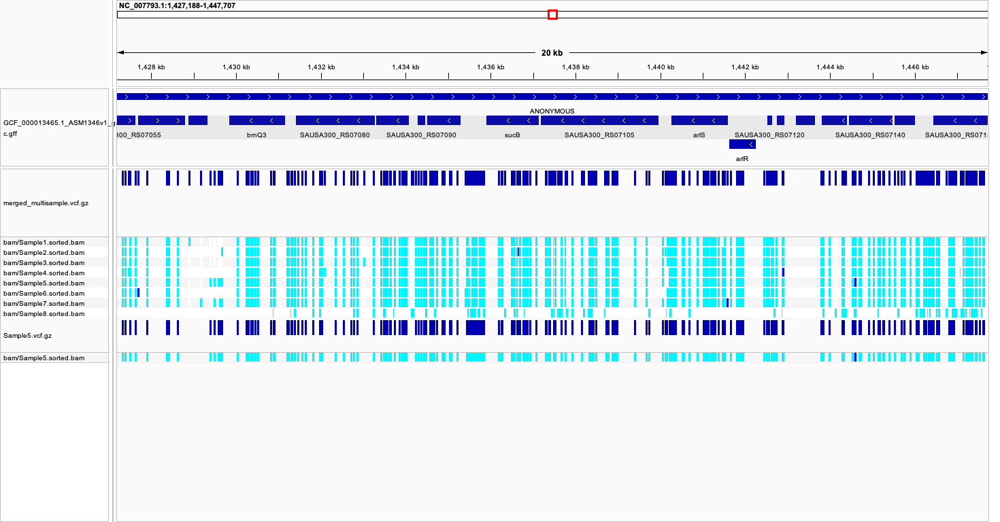

# Week10 - Variant calling pipeline

This assignment consists of two makefiles, one for variant calling and the other makefile to merge the samples and make a multiple sample vcf file. This script is extended from the previous assignment by including another target named vcf.


## Usage 

```bash

make -f makefile.mk usage

```
## To run the script on single sample

```bash

# To run the variant calling script for single sample

make -f makefile.mk all  SRR=SRR35862149 SAMPLE=S1 COVERAGE=17

```

## To run multiple samples

* The below script takes the samples from the design.csv file and performs alignment and variant calling using GNU parallel.

```bash

# Download Genome and index it (this is required only once for all the samples because the reference genome is same)

make -f makefile.mk genome index

# preview the commands before executing (Dry run)
cat design.csv | parallel --jobs 3 --colsep , --header : --eta --bar --verbose \
make --dry-run -f makefile_2.mk process_sample SRR={SRR} SAMPLE={name} COVERAGE={coverage}

# Run multiple samples from design.csv file uing GNU parallel
# Included "eta, bar, and verbose" to see the real time progress

cat design.csv | parallel --jobs 3 --colsep , --header : --eta --bar --verbose \
make -f makefile.mk process_sample SRR={SRR} SAMPLE={name} COVERAGE={coverage}


# After variant calling, use the below make file (multiple_vcf.mk) to merge the vcf files and perform indexing to it.

make -f multiple_vcf.mk all

```


## Description of tasks from the makefile

| Task                | Description                                                                 |
|----------------------|------------------------------------------------------------------------------|
| calculate_coverage   | Determines how many reads to download based on genome size and desired coverage |
| download_reads       | Downloads only the required number of reads from SRA                        |
| fastqc               | Generates quality control reports for the downloaded reads                  |
| genome               | Fetches the reference genome sequence                                       |
| index                | Creates index files for the reference genome                                |
| align                | Aligns reads to the reference and creates sorted BAM files                  |
| stats                | Generates alignment statistics and metrics                                  |
| bigwig               | Creates BigWig coverage tracks from aligned reads                           |
| vcf                  | Calling variants                                                            |

## IGV Visualization




