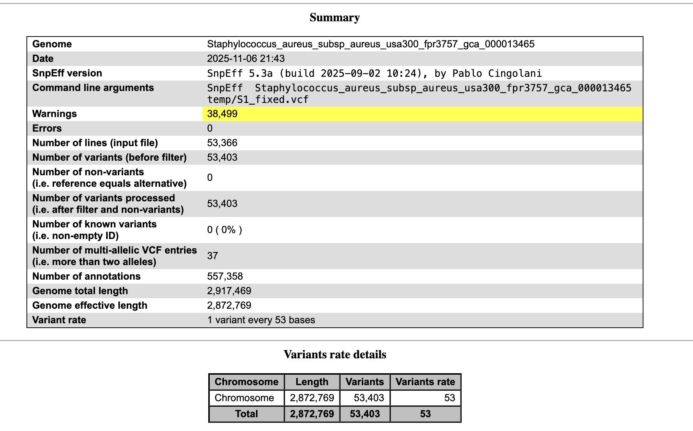
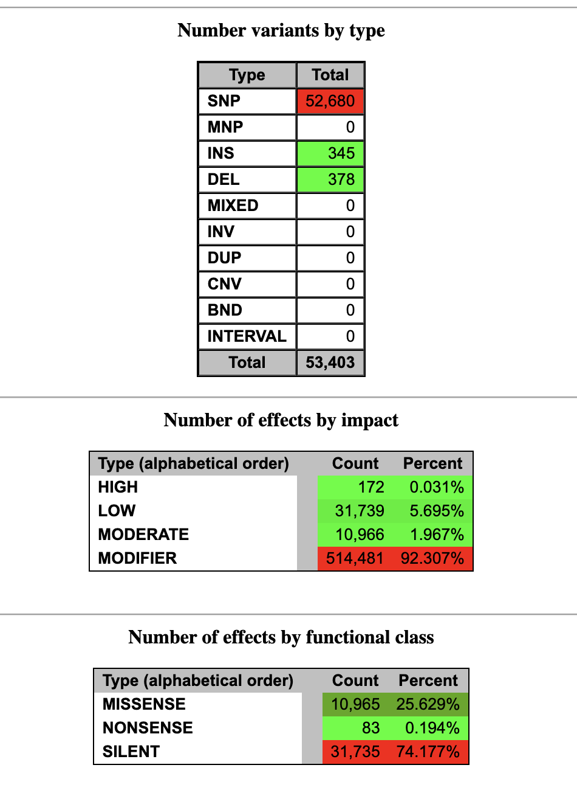
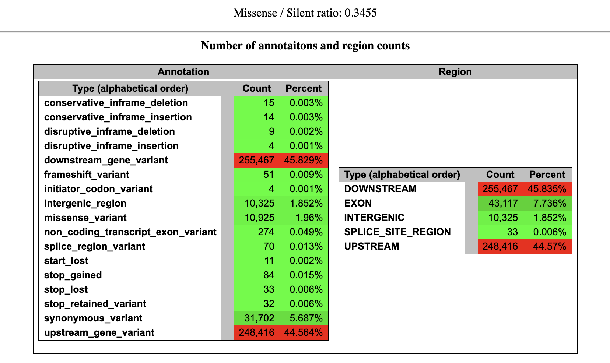

# Variant effect evaluation - Week11

This Makefile is an extension of the previous assignment by including a new target named "vcf_annotation". This makefile can perform reads alignment, variant calling and variant annotation.

## Requirement
1. Installing the required package
* I used snpeff package for this assignment.

```bash
# install SnpEff using conda
conda install -c bioconda snpeff
```

2. Download the reference database for the organism
* I downloaded the database for Staphylococcus aureus subsp. aureus USA300_FPR3757 based on my accession ID : NC_007793
  
```bash

# check available SnpEff databases for Staphylococcus aureus USA300
snpEff databases | grep -i "aureus" | grep -i "usa300"

# copy the snpEff.config file to the current directory
# This step will enable us to download the files required for vcf annotation in the current directory.
# Otherwise it downloads in the default path where the snpEFF was downloaded
# This step just makes things easy to locate, you can skip this and check in the default path as well for download.

cp /opt/anaconda3/envs/bioinformatics/share/snpeff-5.3.0a-1/snpEff.config ./snpEff.config

# to download the SnpEff database for Staphylococcus aureus USA300_FPR3757
snpEff download Staphylococcus_aureus_subsp_aureus_usa300_fpr3757_gca_000013465

# list the files in the SnpEff data directory for Staphylococcus aureus USA300_FPR3757

ls -l ./data/Staphylococcus_aureus_subsp_aureus_usa300_fpr3757_gca_000013465/
# You should find these files within the created directory - sequence.Chromosome.bin, sequence.bin, snpEffectPredictor.bin


```


## Usage

Primary task is to download the genome and index it

```bash
make -f makefile.mk genome index
```

To work with a single sample 

```bash
make -f makefile.mk process_sample SRR=SRR35862149 SAMPLE=S1 COVERAGE=17
```

To work on multiple samples

```bash
cat design.csv | parallel --jobs 3 --colsep , --header : --eta --bar --verbose \
  make -f makefile.mk process_sample SRR={SRR} SAMPLE={name} COVERAGE={coverage}


# To merge the VCF files - if you work with multiple samples this step is needed

make -f makefile.mk finalize
```


Description of tasks from the makefile

| Task                | Description                                                                 |
|----------------------|------------------------------------------------------------------------------|
| calculate_coverage   | Determines how many reads to download based on genome size and desired coverage |
| download_reads       | Downloads only the required number of reads from SRA                        |
| fastqc               | Generates quality control reports for the downloaded reads                  |
| genome               | Fetches the reference genome sequence                                       |
| index                | Creates index files for the reference genome                                |
| process_sample       | Complete pipeline for individual sample                                     |
| align                | Aligns reads to the reference and creates sorted BAM files                  |
| stats                | Generates alignment statistics and metrics                                  |
| bigwig               | Creates BigWig coverage tracks from aligned reads                           |
| vcf                  | Calling variants                                                            |
| merge_vcfs           | merge the generated vcf files                                               |
| vcf_annotation       | performs annotation using snpeff tool                                       |
| finalize             | This performs merging vcf and annotating the merged vcf file                |


## Variants identified

To select three varinats from a sample

```bash

grep -v '^#' S1_annotated.vcf | head -n 3 > s1_subset.vcf

```

**Variant 1: Position 89 G>A**

* **Basic Change:**  G to A substitution at position 89.

* **Genotype:** Homozygous Alternate (1/1). The individual has two 'A' alleles at this position.

* **Impact:** It is an Upstream Gene Variant (MODIFIER). This variant is located before the start of the gene.

* **Key Affected Genes & Distance from Start:**

1. dnaA: 455 bases
2. dnaN: 2094 bases
3. recF: 3850 bases
4. gyrB: 4972 bases

* **Quality:** High quality (124.416).


**Variant 2: Position 93 G>A**

* **Basic Change:**  G to A substitution at position 93.

* **Genotype:** Homozygous Alternate (1/1).

* **Impact:** Upstream Gene Variant (MODIFIER).

* **Key Affected Genes & Distance from Start:**

This variant is very close to the first one, just 4 bases away. The distances are slightly different:

1. dnaA: 451 bases
2. dnaN: 2090 bases
3. recF: 3846 bases
4. gyrB: 4968 bases

**Quality:** Also high quality (124.416) with identical read support.


**Variant 3: position 116 C>T**

* **Basic Change:**  C to T substitution at position 116.

* **Genotype:** Homozygous Alternate (1/1).

* **Impact:** Upstream Gene Variant (MODIFIER).

* **Key Affected Genes & Distance from Start:** 

This is also in the same general region, affecting the same set of genes.

1. dnaA: 428 bases
2. dnaN: 2067 bases
3. recF: 3823 bases
4. gyrB: 4945 bases

**Quality:** High quality (123.415).

## HTML Summary file










