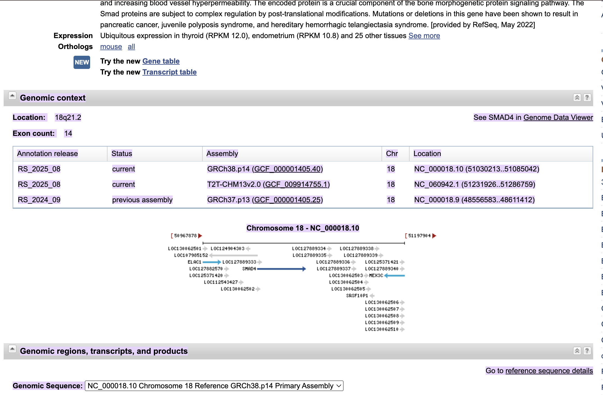
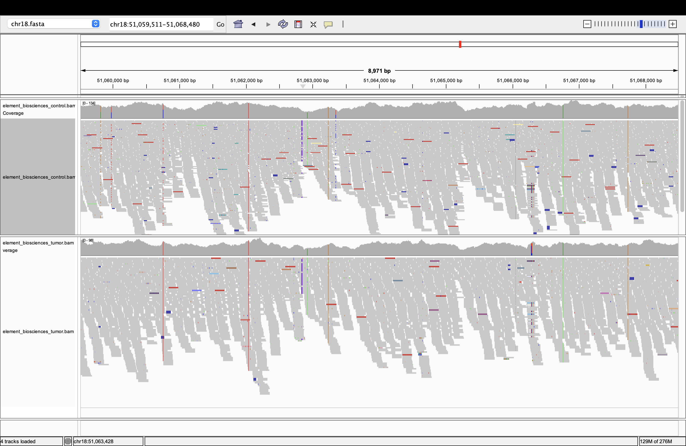
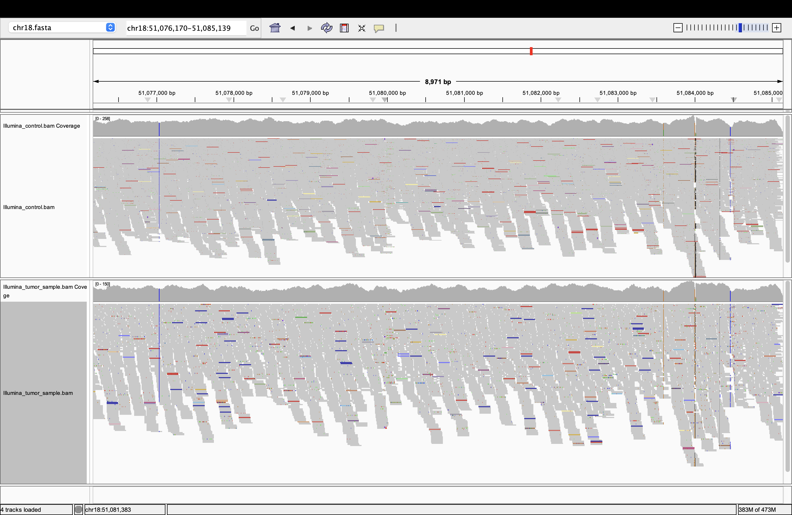
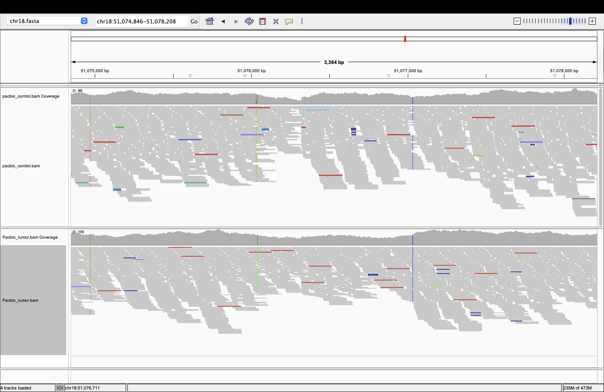

# Evaluate alignments across sequencing platforms - week12

### In this assignment i choose option 1 to compare the alignments across different sequencing platforms used for the cancer in a bottle project. I have selected four sequencing platforms - they are:

1. Illumina sequencing

2. Element biosciences
   
3. oxford nanopore sequencing
   
4. pacific biosciences.


### SMAD4 - Target gene
* I selected SMAD4 gene as my target gene because of its critical role in tumor progression, angiogenesis, metastasis and resistance to chemotherapies.
* I found that SMAD4 gene is located in chromsome 18, and it lies between 51,030,213 to 51,085,042 basepairs within the GRCh38 human genome assembly.

Please refer to the below image



## Usage
* To perform the complete analysis i perfoemd in this assignment, please use the below command!

```bash
bash Alignment_comparision.sh
```

* Below code is used to download the chromosome 18 segment from the human reference genome assembly 'GRCh38'.

```bash

# Set the URL of the reference genome
REF_URL=https://ftp-trace.ncbi.nlm.nih.gov/ReferenceSamples/giab/release/references/GRCh38/GRCh38_GIABv3_no_alt_analysis_set_maskedGRC_decoys_MAP2K3_KMT2C_KCNJ18.fasta.gz

# Download the reference genome
REF=refs/GRCh38.fasta.gz

# The chromosome of interest.
CHR=chr18

# A subset of the reference genome for the region of interest.
REF=refs/${CHR}.fasta

# Create the reference directory
mkdir -p refs

# Download the reference genome
curl -L ${REF_URL} > ${REF}

# Index the reference genome for use with samtools.
samtools faidx ${REF}

```

* To get the alignments for the region of interest, i used the below script

```bash

REGION=chr18:51,030,213-51,085,042

# Set the URL of the BAM file
# This URL is for the bam file from illumina sequencing platform. I repeated the same step for the other three different platforms as well.
BAM_URL=https://ftp-trace.ncbi.nlm.nih.gov/ReferenceSamples/giab/data_somatic/HG008/Liss_lab/BCM_Illumina-WGS_20240313/HG008-N-D_Illumina_169x_GRCh38-GIABv3.bam

# The BAM file name.
BAM=bam/SMAD4.bam


# Create the BAM directory
mkdir -p bam

# Extract the reads for the region of interest.
samtools view -b ${BAM_URL} ${REGION} > ${BAM}

# Index the BAM file.
samtools index ${BAM}

# Get statistics on the BAM file.
samtools flagstat ${BAM}

```

## Alignment Statistics Comparison

**Summary**

|Sample type | Sample                      | Total Reads | Mapped % | Avg Depth | Avg MapQ | Coverage Uniformity (CV%) |
|------------|-----------------------------|-------------|----------|-----------|----------|---------------------------|
|Element Biosciences control Sample| HG008-N-D_Element_chr18     | 33,139      | 99.80%   | 88.27     | 59.78    | 20.68%                    |
|Illumina sequencing control Sample| HG008-N-D_Illumina_chr18    | 63,904      | 99.83%   | 173.23    | 59.67    | 12.80%                    |
|Pacific biosciences control sample| HG008-N-D_PacBio_chr18      | 20,050      | 98.61%   | 51.86     | 58.97    | 26.51%                    |
|Element biosciences tumor sample| HG008-T_Element_chr18       | 21,190      | 99.87%   | 56.77     | 59.81    | 24.77%                    |
|Illumina sequencing tumor Sample| HG008-T_Illumina_chr18      | 35,990      | 99.69%   | 97.38     | 59.49    | 15.15%                    |
|Oxford nanopore tumor sample| HG008-T_ONT_chr18           | 63          | 100.00%  | 8.77      | 60.00    | 95.87%                    |
|Pacific biosciences tumor sample| HG008-T_PacBio_chr18        | 26,967      | 99.19%   | 70.98     | 59.34    | 24.37%                    |


### Validation Metrics:

* Mapping % = Percentage of reads that successfully aligned to the reference genome (more is better)
* Avg Depth = How many times each position was sequenced on average (coverage) (more is better)
* Avg MapQ = How confident we are in the alignment accuracy (quality score) (more is better)
* Coverage Uniformity = How evenly the reads are distributed across the region (consistency) (less is better - lower CV% means more uniform coverage)

## Key Observations

**Sequencing Platform Performance**

1. Illumina Sequencing:

* Highest sequencing depth (Control: 173.23×, Tumor: 97.38×)
* Best coverage uniformity (Lowest CV%: 12.80%-15.15%)
* Excellent mapping rate (>99.69%)
* Most consistent performance across metrics

2. Element Biosciences:

* Excellent mapping quality (Highest Avg MapQ: 59.78-59.81)
* Good mapping rates (>99.80%)
* Moderate coverage uniformity (CV%: 20.68%-24.77%)
* Reasonable depth (56.77-88.27×)

3. Pacific Biosciences:

* Variable performance between control and tumor samples
* Lower mapping rates compared to other platforms (98.61%-99.19%)
* Moderate coverage uniformity (CV%: 24.37%-26.51%)
* Good depth range (51.86-70.98×)

4. Oxford Nanopore:
* Extremely low sequencing depth (Only 8.77×)
* Very poor coverage uniformity (Highest CV%: 95.87%)
* Perfect mapping rate and quality (100%, 60.00 MapQ) but limited by very few reads


**Control vs Tumor Sample patterns**

1. Control samples generally have higher depth than tumor samples for the same platform
2. Mapping quality remains consistent between control and tumor samples
3. Coverage uniformity is slightly better in control samples

**Performance Rank**

* By Depth: Illumina > Element Biosciences > Pacific Biosciences > Oxford Nanopore
* By Mapping Quality: All platforms good (>58.97), with Element Biosciences slightly leading
* By Coverage Uniformity: Illumina > Element Biosciences > Pacific Biosciences > Oxford Nanopore

## IGV Visualization


**Control and Tumor samples from Element Biosciences**



**Control and Tumor samples from Illumina platform**



**Control and Tumor samples from Pacific biosciences**



