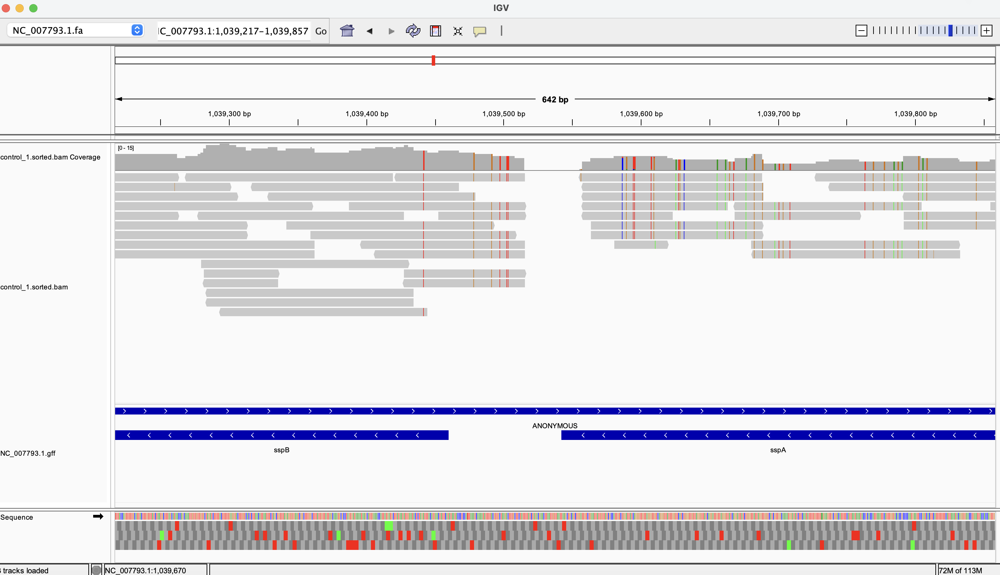
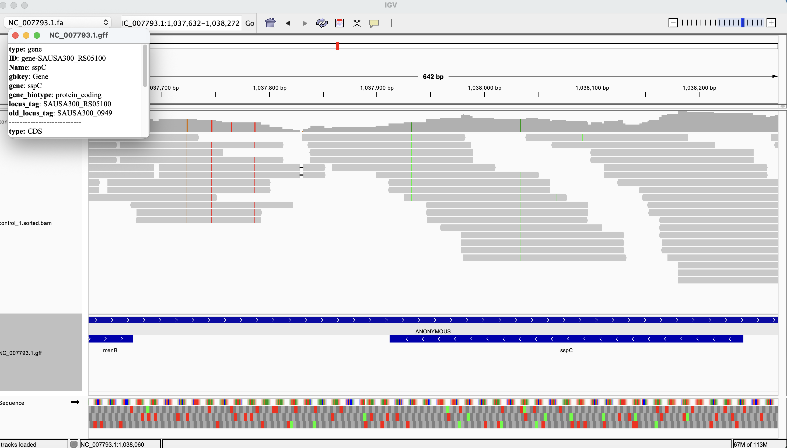
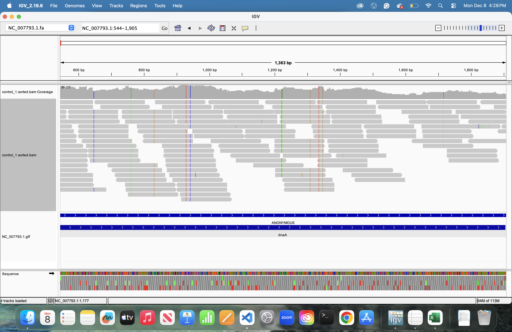
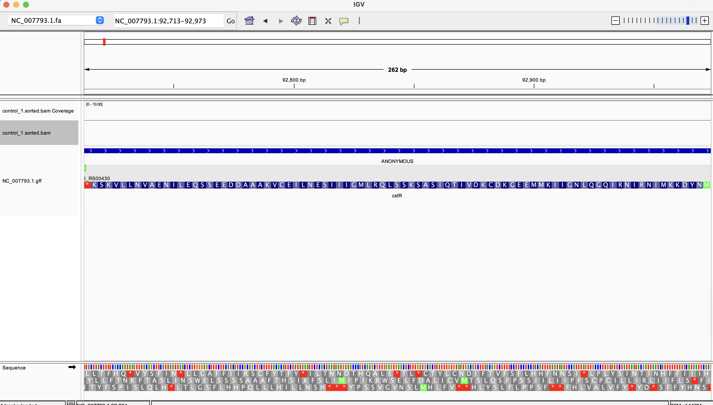

# Week-13 : Generate a genome-based RNA-Seq count matrix

The make file present in this assignment performs counting the number of reads after sequence alignment and generates a count matrix and summary of the assigned and unassigned reads.

## Requirements

```bash

# Please install the following libraries for counting the reads

conda install -c conda-forge ncbi-datasets-cli
conda install -c bioconda subread
```

## Usage 

```bash
make -f makefile.mk usage

# downloading the genome and the gff files and indexing, only needed once.
make -f makefile.mk genome annotation index

# To run the whole make file for read count matrix generation.
cat design.csv | parallel --eta --jobs 7 --colsep , --header : \
make -f makefile.mk process_sample SRR={SRR} SAMPLE={name} COVERAGE={coverage}

```


Description of tasks from the makefile

| Task                | Description                                                                 |
|---------------------|-----------------------------------------------------------------------------|
| usage               | Displays help information and pipeline usage instructions                   |
| genome              | Fetches the reference genome sequence from NCBI                             |
| annotation          | Downloads the GFF annotation file for gene features                         |
| index               | Creates BWA and samtools index files for the reference genome               |
| calculate_coverage  | Determines how many reads to download based on genome size and desired coverage |
| download_reads      | Downloads only the required number of reads from SRA                        |
| fastqc              | Generates quality control reports for the downloaded reads                  |
| align               | Aligns reads to the reference and creates sorted BAM files                  |
| stats               | Generates alignment statistics and metrics                                  |
| bigwig              | Creates BigWig coverage tracks from aligned reads                           |
| process_sample      | Runs complete per-sample pipeline (coverage → reads → fastqc → align → stats → bigwig) |
| count_matrix        | Counts reads per gene across all samples and generates the count matrix     |
| clean               | Removes all generated files and directories                                 |


## IGV Visualization





* The above IGV screenshots represent the presence of aligned reads at the annotated genes and absent at the regions where the gff annotations are empty which reflects that the alinged segments are RNA reads






I tried to check if the read counts i saw in the  count matrix i calculated with the IGV alignment, and the results reflect the same. 
I checked for two genes from sample 1
dnaA, which showed 138 reads and located from 544 bp to 1905 bp and cstR, which showed 0 reads and located from 92713 bp to 92973 bp. The IGV results also show the same results.

