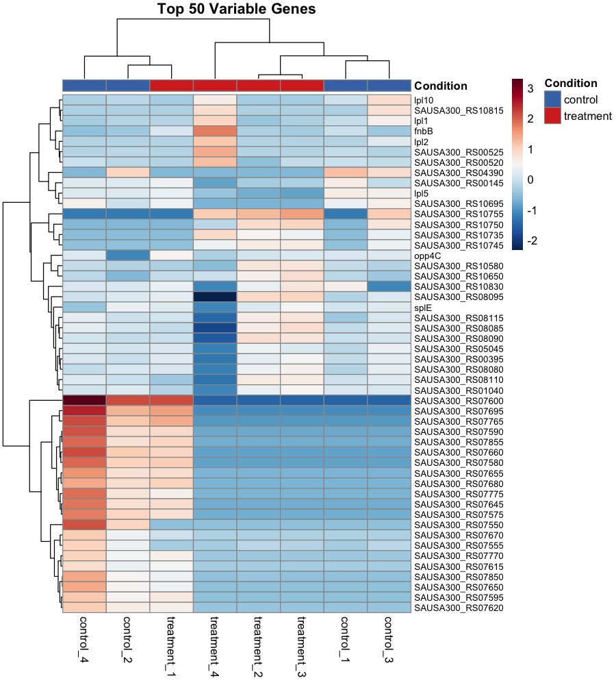
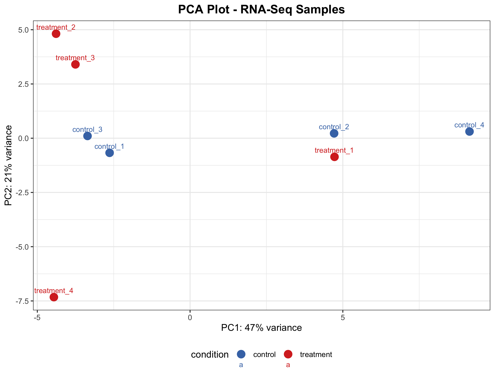
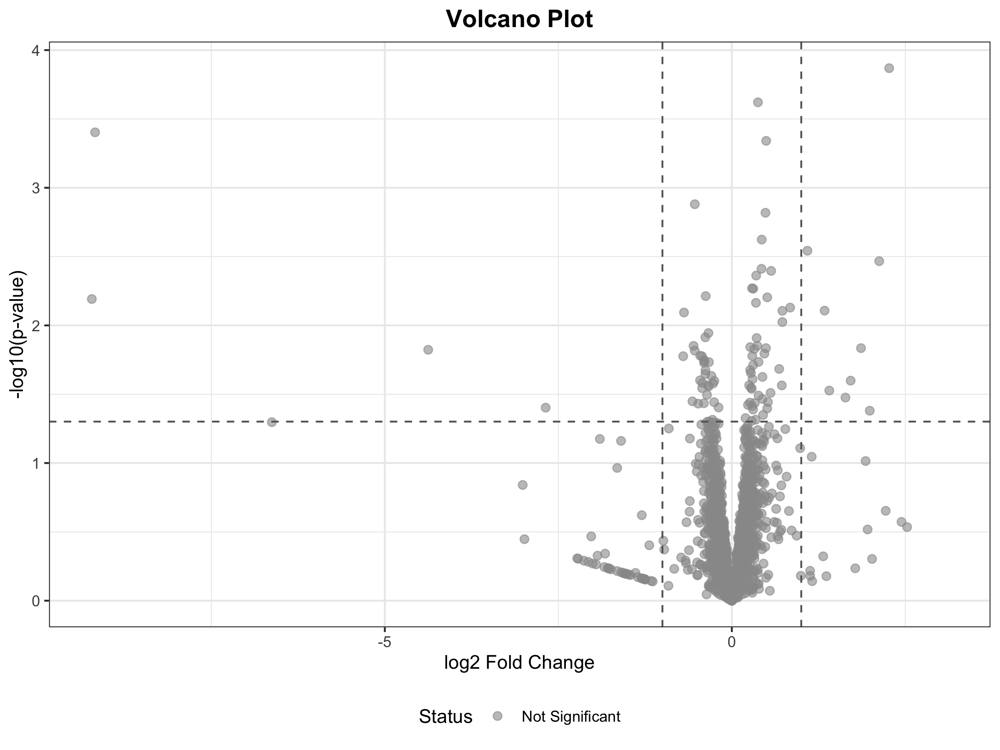

# Week-14 : performing a RNA Seq differential expression study

The make file present in this assignment is a final script to perform differential expression analysis and visualization using the FASTQ reads as input.

## Requirements

```bash

# Please create stats environment following the handbook for differential expression analysis

# Get the code.
bio code

# Run the script to create the stats environment.
bash src/setup/init-stats.sh

```

## Usage 

```bash
make -f Makefile.mk usage

Output:

============================================================
       RNA-Seq Pipeline with Differential Expression        
============================================================

STEP 1: Download genome, annotation, and index (run once)
  make -f Makefile.mk genome annotation index

STEP 2: Process all samples in parallel
  cat design.csv | parallel --jobs 3 --colsep , --header : \
  make -f Makefile.mk process_sample SRR={SRR} SAMPLE={name} COVERAGE={coverage}

STEP 3: Generate count matrix (after all samples processed)
  make -f Makefile.mk count_matrix

STEP 4: Run differential expression analysis (requires stats env)
  conda activate stats
  make -f Makefile.mk differential_expression

STEP 5: Generate visualizations
  make -f Makefile.mk visualizations

STEP 6: Run functional enrichment analysis
  make -f Makefile.mk enrichment

Or run all DE analysis steps at once:
  make -f Makefile.mk full_de_analysis

============================================================

```


Description of tasks from the makefile

| Task                | Description                                                                 |
|---------------------|-----------------------------------------------------------------------------|
| usage               | Displays help information and pipeline usage instructions                   |
| genome              | Fetches the reference genome sequence from NCBI                             |
| annotation          | Downloads the GFF annotation file for gene features                         |
| index               | Creates BWA and samtools index files for the reference genome               |
| calculate_coverage  | Determines how many reads to download based on genome size and desired coverage |
| download_reads      | Downloads only the required number of reads from SRA                        |
| fastqc              | Generates quality control reports for the downloaded reads                  |
| align               | Aligns reads to the reference and creates sorted BAM files                  |
| stats               | Generates alignment statistics and metrics                                  |
| bigwig              | Creates BigWig coverage tracks from aligned reads                           |
| process_sample      | Runs complete per-sample pipeline (coverage → reads → fastqc → align → stats → bigwig) |
| count_matrix        | Counts reads per gene across all samples and generates the count matrix     |
| differential_expression | Performs differential expression analysis                               |
| visualizations |     Generates heatmaps and PCA plots for the differential expression results     |
| enrichment |    performs enrichment analysis / this step can also be done useing genescape library |
| full_de_analysis | This will perform DE analysis, visualization and enrichment all together|
| clean               | Removes all generated files and directories                                 |


## DE Results Visualization






